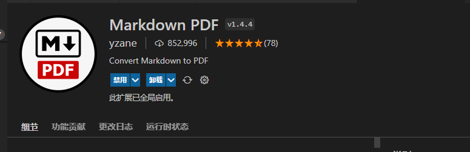

## 背景

本来想写个个人简历网站，但是没有好的想法，做出来也就是写见不得人的烂尾工程，还是简单点好，最后选择使用md简历

## markdown写简历

这个markdown基础语法在之前的博客里面有讲到，今天就略过了。
主要内容也就是个人信息，工作经历，项目经验

## md文档转pdf

### 转换插件Markdown PDF

我用的是VSCode编辑器 插件 Markdown PDF

### 使用方式

Fn1 调出vscode命令窗口，输入markdown即可出现相关命令，可以转成pdf或者其他类型

